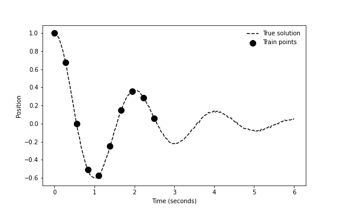

# Study of Gravitational Physics Informed Neural Networks (PINNs)

## Run the repo

I used `python=3.10` to develop that repo. First, clone the repo:

```cmd
git clone https://github.com/amigourou/PINNS.git
cd PINNS
```

Create your virtual environment (or conda):
```cmd
conda create -n env_pinns python=3.10
```
Install the dependencies:

```cmd
pip install -e .
pip install -r requirements.txt
```

## About the repo


In this repo, I explore **Physics Informed Neural Networks**.

I studied in particular the multiple bodies problem, which is known not to have analytical solutions for $N_{bodies} \ge 2$ and to be chaotic for the (at least) three-body problem.

The two use cases I studied were :
- **Extrapolation** : from few data points (observations) at the beginning of the trajectory, extrapolate to time steps (far) ahead, thus on the whole study period.
- **Interpolation** : from few data points on the whole study period, interpolate to match the true solution.

## About PINNs

### Damped spring example 
To go straight to the point, PINNs are Neural Networks in which we inject prior knowledge about the problem we want to solve. In usual regression tasks, we train our neural network to reconstruct the target from data points by minimizing the distance between the output of the model and the corresponding target : $\|\phi(t) - x\|^2$ = 0 (MSE Loss) with $\phi$ being our NN and $(t,x)$ our data points.

Let's take a simple example : we want to fit the observed x positions of a dampen spring across a given time period $[0,T]$. After normalization and in the harmonc case, the analytical solution is : $x(t) = x_0\exp(-\xi \omega_0 t)(\cos(\omega_0t) + \frac{\xi}{\sqrt{1-\xi^2}}\sin(\omega_0t))$ :

<!-- [] -->


Now, if we observe points on that trajectory, but not on the whole time period:



We fit our regular Neural Network with MSE loss :


Here, the model fits the observed points, but has absolutly no reasons to extrapolate to unseen points according to the physics of the problem. 

The idea is thus to constrain the solutions of our Neural Network to the space of physics solutions of that problem, i.e. to be solution of the ODE of the damped spring : $\ddot{\phi}(\textbf{t}) + 2\xi \omega \dot{\phi}(\textbf{t}) + \omega^2 = 0$. Thus, we can regularize our training by adding a loss, that would be computed on the whole time period of interest : $\mathcal{L}_{reg} = \|\ddot{\phi}(\textbf{t}) + 2\xi \omega \dot{\phi}(\textbf{t}) + \omega^2\|_2^2$. By minimizing it, thus forcing it to be close to 0, our neural network is solution of the ODE and we obtain:


That is, a model that can successfully extrapolate to unseen data points further on the time period.

### Code

The code associated with that example is located in ```SpringProblem/```. Some utils are present:
- main.py : to train the PINN. 
- physics_utils.py : a class that defines the Damped Spring problem
- model.py : a class for the model, with a method for the physics loss
- dataset.py : a custom pytorch dataset for training
